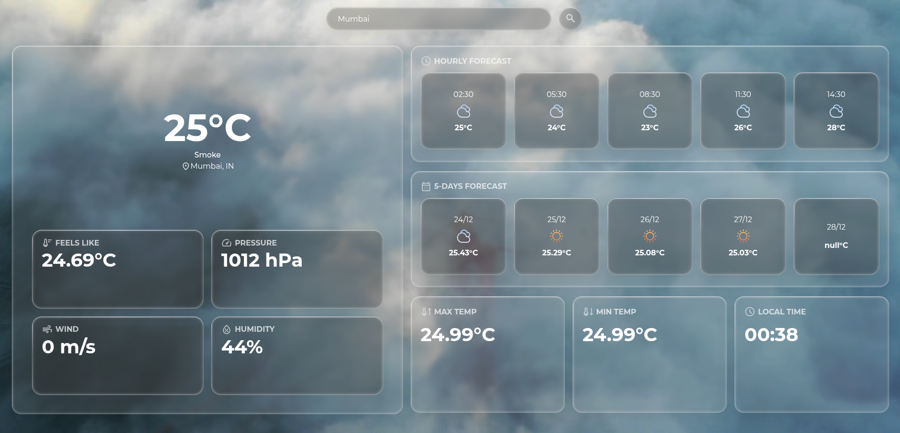
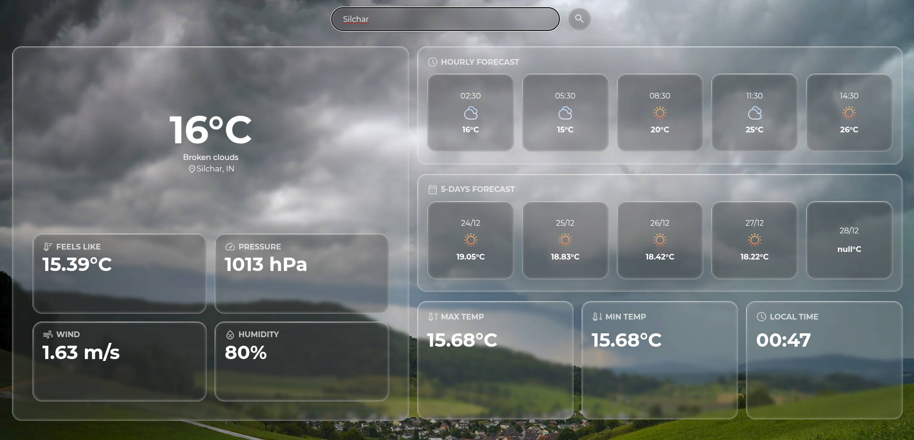

# Mausam-Web 🌦️

Mausam-Web is a lightweight weather web application that allows users to search for real-time weather information of any city.  
The project is built using **vanilla HTML, CSS, and JavaScript**, focusing on API integration and DOM manipulation.

🔗 Live Demo: https://mausam-webapp.vercel.app

---

## 🚀 Features

- Search weather details by **city name**
- Displays:
  - Temperature
  - Weather condition (Dynamic Background)
  - Pressure
  - Wind Speed
  - Humidity
  - Hourly Forecast
  - Upcoming 5 Days Forecast
  - Maximum & Minimum Temperature
- Real-time data fetched using a weather API
- Clean and responsive UI
- No frameworks — pure frontend fundamentals

---

## 📸 Screenshot



---

## 🧠 What This Project Demonstrates

- Fetching data from an **external REST API**
- Handling **asynchronous JavaScript** using `fetch()`
- Parsing and displaying JSON data dynamically
- DOM manipulation based on user input
- Error handling for invalid city names

---

## 🛠️ Tech Stack

| Technology | Usage |
|----------|-------|
| HTML | Page structure |
| CSS | Styling & layout |
| JavaScript | Logic, API calls, DOM updates |

---

## 📂 Project Structure

```
Mausam-Web/
├── index.html
├── style.css
├── script.js
└── assets/
```
---

## ⚙️ How to Run Locally
1. Clone the repository:
```
git clone https://github.com/joysarkar83/Mausam-Web.git
```
2. Generate your own API key from: https://openweathermap.org/api
3. Add the API key in script.js
4. Open index.html in your browser
5. Enter a city name or grant location access and view weather details
